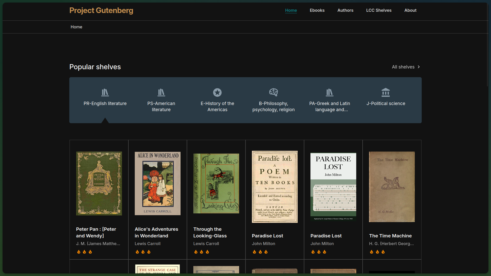
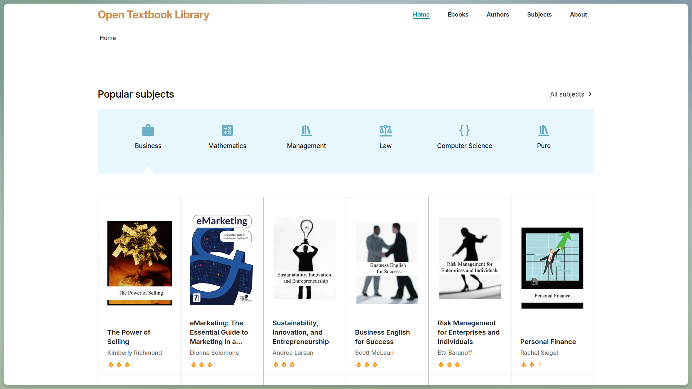
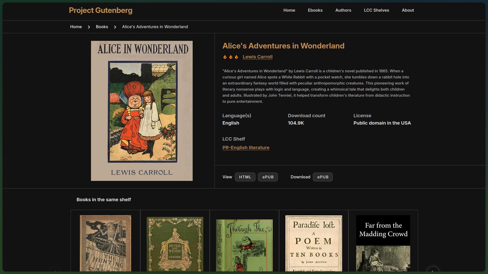
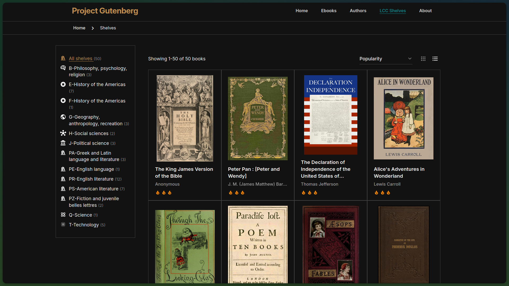
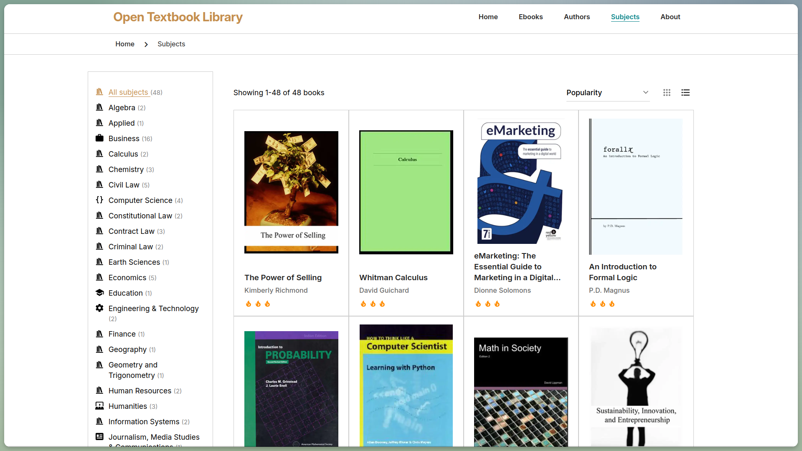
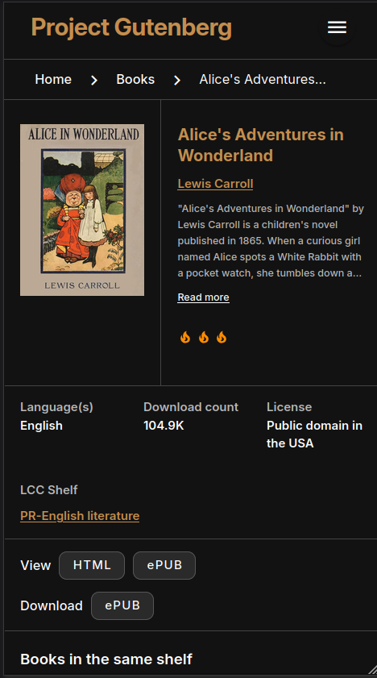
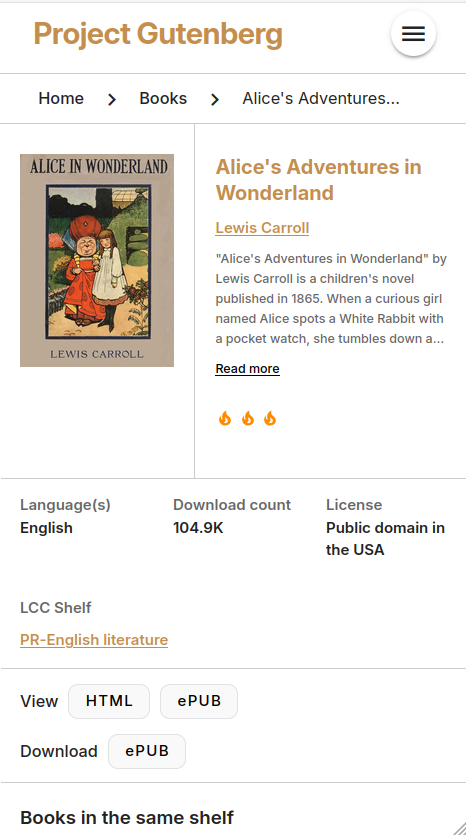

# Gutenberg Offline

This multi-source scraper downloads content from [Project Gutenberg](https://www.gutenberg.org) and the [Open Textbook Library](https://open.umn.edu/opentextbooks/) and packages it into a [ZIM](https://openzim.org) file, a clean and user-friendly format for storing content for offline usage.

The ZIM file includes a modern, responsive Vue.js interface with features like:
- Browse books by title, author, or source-specific categories such as Library of Congress Classification (LCC) shelves or Open Textbook Library subjects
- Advanced filtering by language, format, and more
- Built-in EPUB and PDF readers
- Full-text search across all content
- Multilingual support with automatic language detection
- Responsive design that works on desktop and mobile devices
- No-JavaScript fallback for maximum compatibility

[](https://www.codefactor.io/repository/github/openzim/gutenberg)
[](https://www.gnu.org/licenses/gpl-3.0)
[](https://codecov.io/gh/openzim/gutenberg)
[](https://pypi.org/project/gutenberg2zim/)
[](https://pypi.org/project/gutenberg2zim/)
[](https://ghcr.io/openzim/gutenberg)

## Getting Started

The recommended way to use the scraper is with Docker, which includes all dependencies pre-installed.

### Using Docker (Recommended)

**Run the scraper**:

```bash
docker run -v $(pwd)/output:/output ghcr.io/openzim/gutenberg gutenberg2zim
```

The `-v $(pwd)/output:/output` option mounts your local `output` folder to save the ZIM file.

**Note**: On Windows PowerShell, replace `$(pwd)` with `${PWD}`. Alternatively, use the full path: `-v C:\Users\YourName\output:/output`

**View available options**:

```bash
docker run ghcr.io/openzim/gutenberg gutenberg2zim --help
```

Example with custom options:

```bash
docker run -v $(pwd)/output:/output ghcr.io/openzim/gutenberg \
  gutenberg2zim -l en,fr -f pdf --books 100-200 --lcc-shelves all
```

### Using PyPI

Alternatively, install from PyPI:

```bash
pip install gutenberg2zim
gutenberg2zim --help
```

Note: You'll need to install system dependencies (zim-tools) separately. See [CONTRIBUTING.md](CONTRIBUTING.md) for details.

### Scraping Sources

The scraper supports two sources. Select a source with --source:

--source=<source>    Source slug or short name:
                     gutenberg (PG) or opentextbooks (OTL)
                     Default: gutenberg

### Project Gutenberg

Select Project Gutenberg with `--source=gutenberg` (or `--source=PG`).

For example:

```bash
docker run -v $(pwd)/output:/output ghcr.io/openzim/gutenberg \
  gutenberg2zim --source=gutenberg -l en,fr -f pdf --books=100-200 --lcc-shelves=all
```

The Project Gutenberg-specific option is:

```text
--lcc-shelves=<shelves>    LCC shelf codes (comma-separated or 'all')
```

For example:

```bash
gutenberg2zim --source=gutenberg --lcc-shelves=P,PR,Q
```

### Open Textbook Library

Select the Open Textbook Library with `--source=opentextbooks` (or `--source=OTL`).

To scrape books from one or more subjects:

```bash
docker run -v $(pwd)/output:/output ghcr.io/openzim/gutenberg \
  gutenberg2zim --source=opentextbooks --subjects=Business,Mathematics
```

To select specific OTL records:

```bash
docker run -v $(pwd)/output:/output ghcr.io/openzim/gutenberg \
  gutenberg2zim --source=opentextbooks --otl-ids=<id1>,<id2>,<id3>
```

The Open Textbook Library-specific options are:

```text
--subjects=<subjects>      Comma-separated Open Textbook Library subjects
--otl-ids=<ids>            Exact Open Textbook Library record IDs
--list-subjects            List Open Textbook Library subjects and exit
--refresh-catalog          Refresh the Open Textbook Library CSV catalog and exit
```

`--otl-ids` and `--books` cannot be used together.

## Command-Line Options

### Source Selection

```text
--source=<source>                  Source slug or short name:
                                   gutenberg (PG) or opentextbooks (OTL)
                                   Default: gutenberg
```

### Common Options

```text
-h --help                          Display this help message
--overwrite                        Overwrite existing ZIM file

-l --languages=<list>              Comma-separated language codes (ISO 639-1 or ISO 639-3)
-f --formats=<list>                Comma-separated formats (epub, html, pdf, all)

-z --zim-file=<file>               ZIM file output path
--zim-name=<name>                  ZIM name (metadata)
-t --zim-title=<title>             ZIM title
-n --zim-desc=<description>        ZIM description
-L --zim-long-desc=<description>   ZIM long description
--zim-languages=<languages>        ZIM language metadata

-b --books=<ids>                   Source catalog positions/IDs
-c --concurrency=<nb>              Number of concurrent workers (default: 16)

--no-index                          Skip full-text index creation
--title-search                      Enable title-based search
--stats-filename=<filename>        Statistics output file

--publisher=<publisher>            Custom publisher name
--mirror-url=<mirror_url>          Custom source mirror URL
--output=<output_folder>            Output folder
--cache-dir=<cache_folder>          Optional persistent metadata and catalog cache

--primary-color=<color>             Primary UI color
--secondary-color=<color>           Secondary UI color
--ui-dist=<ui_dist>                 Built UI distribution directory
--debug                             Enable verbose output
```

### Project Gutenberg Options

```text
--lcc-shelves=<shelves>             LCC shelf codes (comma-separated or 'all')
```

### Open Textbook Library Options

```text
--subjects=<subjects>               Comma-separated Open Textbook Library subjects
--otl-ids=<ids>                     Exact Open Textbook Library record IDs
--list-subjects                     List Open Textbook Library subjects and exit
--refresh-catalog                   Refresh the Open Textbook Library CSV catalog and exit
```

### Caching

Caching is opt-in. Pass `--cache-dir` to persist source metadata and catalog
data. To reuse cached data in a later run, pass the same directory again;
without `--cache-dir`, the scraper performs a fresh run and does not create a
persistent cache.

## Features

### User Interface
- **Modern Web Interface**: Fast, responsive single-page application with smooth navigation
- **Multiple View Modes**: Switch between grid and list views for books
- **Responsive Design**: Optimized for desktop, tablet, and mobile devices
- **Dark/Light Theme**: Automatic theme switching based on system preferences
- **Customizable Colors**: Configure primary and secondary brand colors

### Content Organization
- **Browse by Books**: View all books with cover images, titles, and authors
- **Browse by Authors**: Explore authors with their complete bibliographies
- **Source-specific Categories**: Browse Project Gutenberg books by LCC shelves or Open Textbook Library books by subjects
- **Smart Pagination**: Efficient navigation through large collections

### Search & Discovery
- **Full-Text Search**: Search across all books, authors, and source-specific categories
- **Quick Filters**: Find authors by name or source-specific category
- **Rich Search Results**: Search results include descriptions and metadata

### Filtering & Sorting
- **Language Filter**: Filter books by language
- **Format Filter**: Filter by available formats
- **Sort Options**: Sort by popularity (where available) or title
- **Sort Order**: Toggle between ascending and descending order

### Book Details
- **Comprehensive Metadata**: Title, subtitle, author, description, languages, license
- **Author Information**: Author name with birth/death years where available
- **Popularity Rating**: Star rating based on download statistics where available
- **Download Counts**: Formatted download statistics where available
- **Source-specific Metadata**: Display source-specific information such as LCC classification
- **Multiple Formats**: Download books in available formats
- **Cover Images**: High-quality book cover images where available

### Internationalization
- **Multiple Languages**: Full UI translations for many languages
- **Automatic Detection**: Detects browser language and sets UI accordingly
- **Language Switcher**: Easy language selection from header menu
- **RTL Support**: Right-to-left layout support for Arabic, Hebrew, etc.

### Accessibility
- **No-JavaScript Fallback**: Complete HTML-only version for browsers without JavaScript
- **Semantic HTML**: Proper heading hierarchy and ARIA labels
- **Keyboard Navigation**: Full keyboard accessibility
- **Screen Reader Support**: ARIA labels and descriptions throughout
- **High Contrast**: Readable text with proper color contrast ratios

### Technical Features
- **ZIM Format**: Compressed, indexed format for offline usage
- **Full-Text Indexing**: Optional full-text search index within ZIM
- **Concurrent Processing**: Multi-threaded book processing for faster scraping
- **Custom Mirrors**: Support for custom source mirror URLs
- **Docker Support**: Pre-built Docker images with all dependencies

## Architecture

The scraper separates source-specific logic from the shared core engine and the web UI.

### Sources

Source implementations live under `scraper/src/gutenberg2zim/sources/`.

Currently supported sources are:

- **Project Gutenberg** (`gutenberg` / `PG`)
- **Open Textbook Library** (`opentextbooks` / `OTL`)

The source registry connects each source implementation to the common pipeline.

### Core Engine

The `scraper/src/gutenberg2zim/core/` package is source-independent. It defines common interfaces (ports) and shared processing for catalog access, metadata, format resolution, rewriting, exporting, and indexing.

The core engine therefore does not need to contain source-specific scraping logic.

### Web UI

The Vue.js UI is maintained separately from the scraper sources. The scraper builds the UI and includes the resulting distribution in the generated ZIM.

This separation means that source implementations, the shared scraping/ZIM pipeline, and the presentation layer can evolve independently.

## Contributing

We welcome contributions! Whether you want to:

- Add or improve UI translations
- Fix bugs or add features
- Improve documentation
- Develop the Vue.js interface

Please see [CONTRIBUTING.md](CONTRIBUTING.md) for detailed guidelines on setting up the development environment, code style, testing, and the pull request process.

Main coding guidelines follow the [openZIM Wiki](https://github.com/openzim/overview/wiki).

## Screenshots

| Project Gutenberg (PG) — Dark Mode | Open Textbook Library (OTL) — Light Mode |
|------------------------------------|------------------------------------------|
| **Home Page**<br> | **Home Page**<br> |
| **Book Page**<br> | **Book Page**<br> |
| **LCC Shelves**<br> | **Subjects**<br> |

### Mobile View

| Dark Mode | Light Mode |
|------------------------------------|------------------------------------------|
|  |  |

## License

[GPLv3](https://www.gnu.org/licenses/gpl-3.0) or later, see
[LICENSE](LICENSE) for more details.
